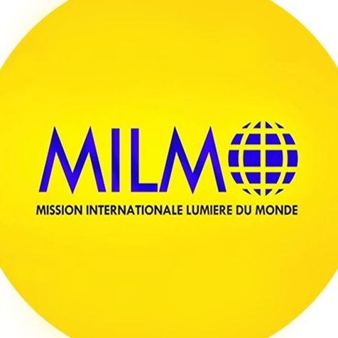

# Mission Internationale Lumière du Monde (MILMO) - [MILMO_crm]

Bienvenue sur le dépôt officiel du projet **[MILMO_crm]** pour la Mission Internationale Lumière du Monde (MILMO). 

## 🌟 À propos de MILMO

La **Mission Internationale Lumière du Monde (MILMO)** est une organisation religieuse dédiée à l'évangélisation et au soutien spirituel. Basée à Cotonou, elle se distingue par son engagement envers ses membres et sa doctrine ancrée dans les valeurs chrétiennes. C'est un lieu de rassemblement pour tous ceux qui cherchent à approfondir leur relation avec Dieu.

## 🚀 Le Projet
Ce dépôt contient le code source de [MILMO_crm]. 

**Objectifs :**
**_Court terme:**
- [ Digitaliser la gestion des membres]
- [ Digitaliser l'accueil des membres]
  
**_Long terme:**
- [Faciliter l'accès aux enseignements et replays des cultes]
- [Permettre les dons et contributions en ligne]

## 📍 Informations Pratiques
- **Localisation :** Akpakpa Sacré Cœur, Rue derrière la Maison du Peuple, VONS Complexe Scolaire Ronsard, 05 BP 980 Cotonou, Bénin.
- **Évaluation :** Recommandée par 100 % de sa communauté.
- **Contact :** +229 97 38 57 49 | ebilmo@yahoo.fr

